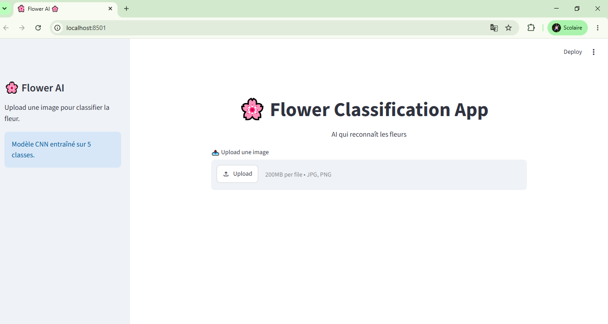
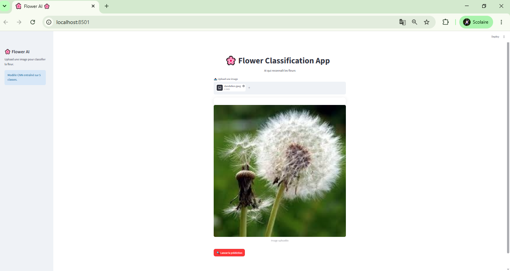
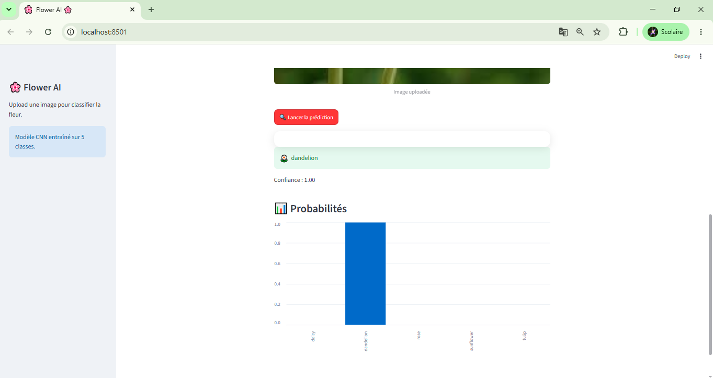
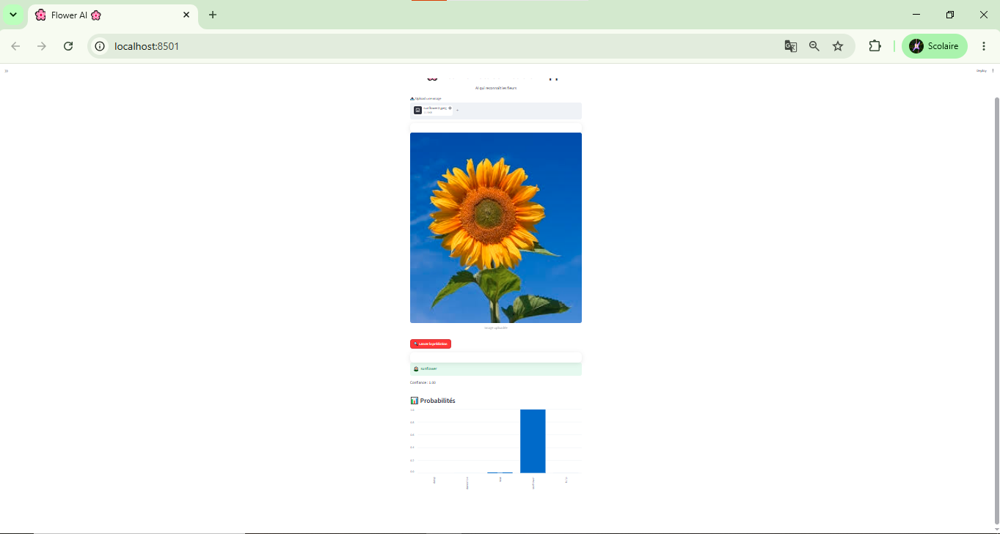

# 🌸 Flower Classification App

A modern web application built with **Streamlit** and **TensorFlow/Keras** that classifies flower images using a Convolutional Neural Network (CNN).

The application allows users to upload an image of a flower and predicts its class among five flower categories while displaying the prediction confidence and the probability distribution for each class.

---

## 📸 Application Preview

### 🏠 Home Page



---

### 📤 Upload an Image



---

### 🤖 Prediction Result



---

### 📊 Probability Distribution


---

### 🌻 Another Prediction Example



---

# ✨ Features

- 🌼 Upload flower images (JPG and PNG)
- 🤖 CNN-based flower classification
- 📈 Display prediction confidence
- 📊 Interactive probability chart
- 🎨 Clean and responsive Streamlit interface
- ⚡ Fast inference using a trained TensorFlow model

---

# 🌺 Supported Flower Classes

The model has been trained to recognize the following five flower species:

- 🌼 Daisy
- 🌿 Dandelion
- 🌹 Rose
- 🌻 Sunflower
- 🌷 Tulip

---

# 🛠️ Technologies Used

- Python
- Streamlit
- TensorFlow / Keras
- NumPy
- Pillow (PIL)
- Plotly
- Matplotlib

---

# 📂 Project Structure

```text
Flower-Classification-App/
│
├── screens/
│   ├── screen1.png
│   ├── screen2.png
│   ├── screen3.png
│   ├── screen4.png
│   └── screen5.png
│
├── app2.py                           # Main Streamlit application
├── CNN-Flower_Classification.ipynb   # CNN training notebook
├── flower_classification_model.keras # Trained model
├── requirements.txt
├── README.md
└── .gitignore
```

---

# ⚙️ Installation

## 1. Clone the repository

```bash
git clone https://github.com/your-username/Flower-Classification-App.git
cd Flower-Classification-App
```

Replace **your-username** with your GitHub username.

---

## 2. Create a virtual environment (Recommended)

### Windows

```bash
python -m venv .venv
.venv\Scripts\activate
```

### Linux / macOS

```bash
python3 -m venv .venv
source .venv/bin/activate
```

---

## 3. Install dependencies

```bash
pip install -r requirements.txt
```

---

# 🚀 Run the Application

Start the Streamlit server by running:

```bash
streamlit run app2.py
```

Then open your browser and visit:

```
http://localhost:8501
```

---

# 📦 Requirements

The project requires:

- Python 3.10+
- TensorFlow
- Streamlit
- NumPy
- Pillow
- Plotly
- Matplotlib

All dependencies are listed in the **requirements.txt** file.

---

# 🧠 Model

The project uses a **Convolutional Neural Network (CNN)** built with TensorFlow/Keras.

The trained model is stored in:

```text
flower_classification_model.keras
```

The model is automatically loaded when the Streamlit application starts.

---

# 📚 Training Notebook

The notebook

```text
CNN-Flower_Classification.ipynb
```

contains the complete deep learning pipeline, including:

- Dataset loading
- Data preprocessing
- Data augmentation
- CNN architecture
- Model training
- Validation
- Performance evaluation
- Saving the trained model

---

# 🌼 Dataset

The CNN model was trained on a dataset containing five flower categories:

- Daisy
- Dandelion
- Rose
- Sunflower
- Tulip

Each image is resized and normalized before being fed into the neural network.

---

# 📈 Application Workflow

```text
          Upload Image
                │
                ▼
      Image Preprocessing
                │
                ▼
       CNN Model Prediction
                │
                ▼
     Predicted Flower Class
                │
                ▼
Confidence Score + Probability Chart
```

---

# 🎯 Future Improvements

Some ideas for future development:

- Add support for more flower species
- Display Top-3 predictions
- Drag-and-drop image upload
- Camera support
- Mobile-friendly interface
- Grad-CAM visualization for explainable AI
- Deploy on Streamlit Community Cloud
- Improve model accuracy with transfer learning

---

# 👨‍💻 Author

**Mohamed Aamer**

Master's Student in Computer Science

### Areas of Interest

- Artificial Intelligence
- Deep Learning
- Computer Vision
- Machine Learning
- Data Science
- Full-Stack Development

---

# ⭐ Support the Project

If you found this project useful, consider giving it a ⭐ on GitHub.

It helps others discover the project and motivates future improvements.

---

# 📄 License

This project is intended for educational and research purposes.

Feel free to fork, modify, and improve it.